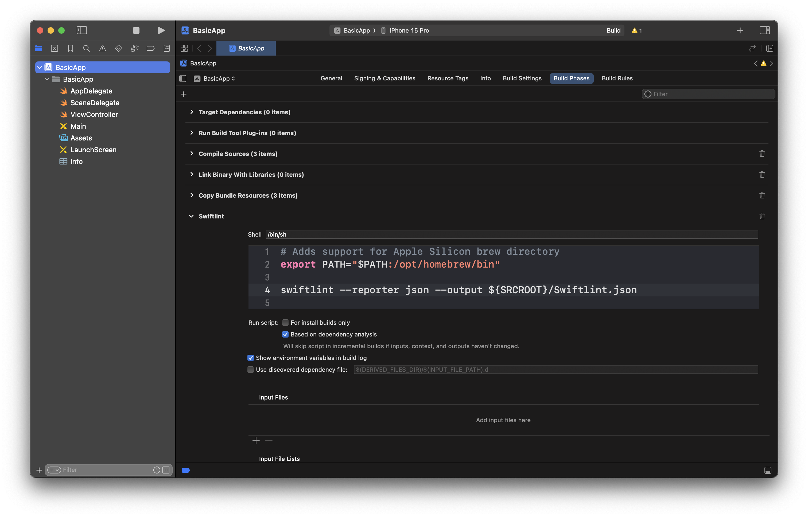
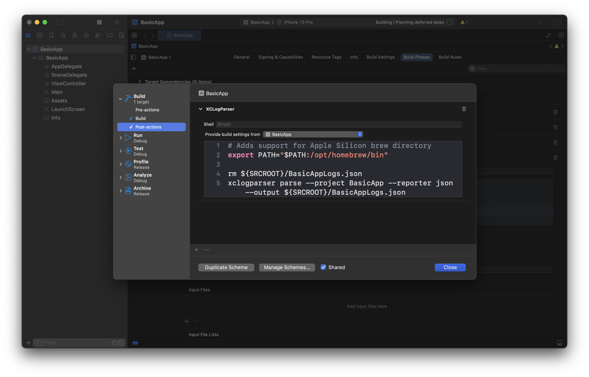

# Métricas iOS

Existem duas ferramentas interessantes que fornecem uma série de dados sobre os projetos iOS: o [XCLogParser](https://github.com/MobileNativeFoundation/XCLogParser) e o [Swiftlint](https://github.com/realm/SwiftLint).

## Instalação

Ambas ferramentas podem ser instaladas via [Homebrew](https://brew.sh):

```sh
brew install xclogparser
brew install swiftlint
```

## Configuração

### Swiftlint 

1. No Xcode, vá até as configurações do projeto.
2. Navegue até **Build Phases** e adicione um novo **Run Script**.
3. Adicione o seguinte comando:

```sh
swiftlint --reporter json --output ${SRCROOT}/Swiftlint.json
```

O output é opcional, mas permite gerar o arquivo de relatórios no local especificado.



### XCLogParser

Para configurar o XCLogParser:

1. No Xcode, vá em **Edit Scheme**.
2. Selecione o **Scheme** desejado (repita o processo para cada Scheme se houver mais de um).
3. Em **Build**, clique em **Post-actions** e adicione um **Run Script** com o seguinte comando:

```sh
xclogparser parse --project BasicApp --reporter json --output ${SRCROOT}/BasicAppLogs.json
```



## Coleta de Resultados

Com a configuração completa, a cada build o Xcode executará ambos os comandos, resultando nos seguintes arquivos:

- [Output XCLogParser](BasicAppLogs.json)
- [Output Swiftlint](Swiftlint.json)

